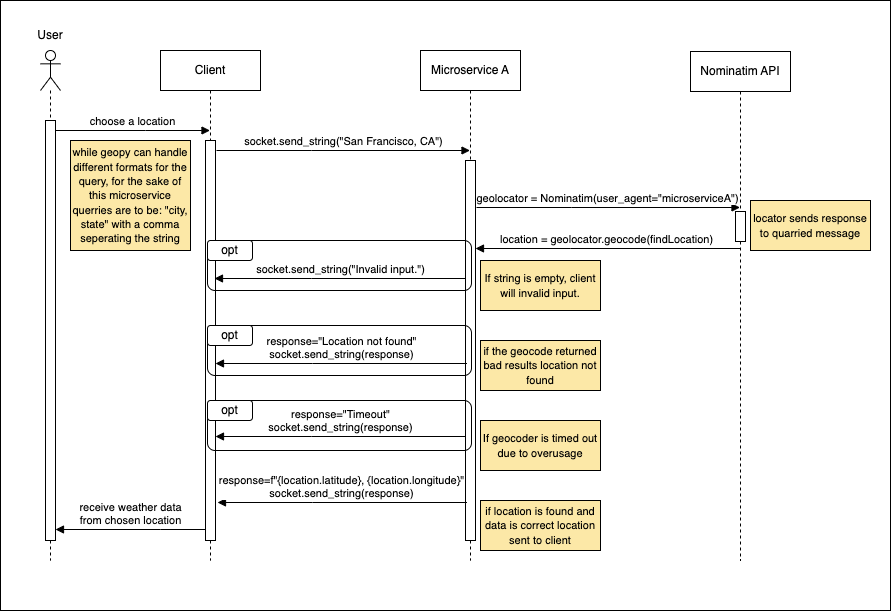

# CS361-Microservice A
written by Michael Cook CS361

## Introduction
This is a microservice written out with the intention to support a partners application in CS361.
The microservice itself recieves a string: "city, state" and returns a string: "longitude, latitude"

## Required Modules

- geopy

- pyzmq

## Usage
The microservice is meant to be

## Example calls for ZeroMQ
Call using "San Francisco, CA"
```
socket.send_string("San Francisco, CA")
```
Recieve
```
message = socket.recv_string()
```
## UML Sequence Diagram


